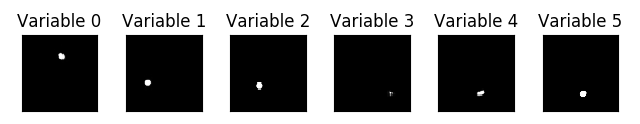
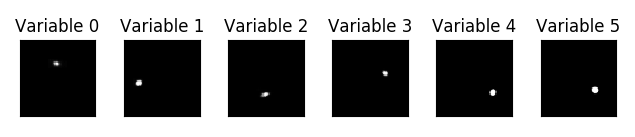
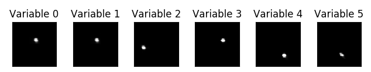

# Learning Interpretable Physical Variables from Image Sequences

This repository contains code to train Autoencoders for learning disentangled latent representations
of single images or image sequences in an unsupervised manner. It also contains code to generate a synthetic dataset
for this purpose. Evaluation functions give qualitative and quantitative feedback on the quality of 
disentanglement.

## Usage

Clone the repository and install the project and its dependencies.

    git clone https://github.com/Mr-Pepe/dl4cv
    cd dl4cv
    pip install -r requirements.txt
    pip install .
  
You can generate the dataset by running
    
    python dl4cv/dataset/generateData.py

## Walks over latent variables

A sample of 2000 sequences was used to calculate the latent encoding for the three architectures.
While holding five of the six variables constant at the mean of the observed values for one model, one latent 
variable is sampled between its observed minimum and maximum value. This shows the influence of 
one latent variable on the generated output image.

### Question Autoencoder

 

### Beta VAE

 

### Annealed VAE

