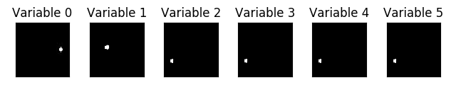

# Learning Interpretable Physical Variables from Image Sequences

This repository contains code to train Autoencoders for learning disentangled latent representations
of single images or image sequences in an unsupervised manner. It also contains code to generate a synthetic dataset
for this purpose. Evaluation functions give qualitative and quantitative feedback on the quality of 
disentanglement.

## Usage

Clone the repository and install the project and its dependencies.

    git clone https://github.com/Mr-Pepe/dl4cv
    cd dl4cv
    pip install -r requirements.txt
    pip install .
  
You can generate the training and evaluation dataset by running
    
    python generateDataset.py
    python generateEvalDataset.py

in the dataset directory.

The models can be trained and evaluated with, e.g.,

    python beta_VAE_with_questions_and_physics.py --train true --eval true
    
inside the final_runs directory. The evaluation can be run straight away using the provided saves.

## Results

A sample of 2000 sequences was used to calculate the latent encoding for the three architectures.
Afterwards, walks over the latent variables were performed one by one.

Please refer to the report for more information.

### &beta;-VAE with questions

 

### &beta;-VAE with physics layer

 

### &beta;-VAE with physics layer and questions

